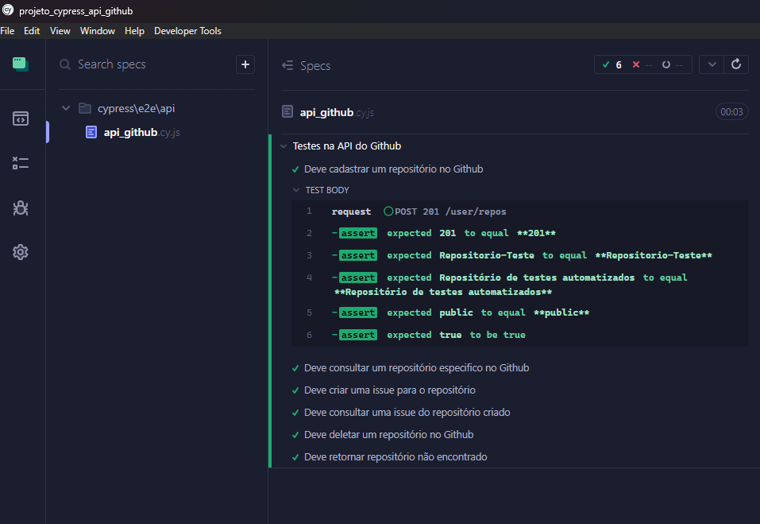

<h1 align="center">🧑‍🎓 Testes Automatizados API GitHub</h1>

 
    

## ✨ Tecnologias

Esse projeto foi desenvolvido com as seguintes tecnologias:

- [Node.js](https://nodejs.org/en/)
- [Cypress](https://www.cypress.io/)

## 💻 Projeto

O projeto tem como responsabilidade realizar testes automatizados na API do GitHub. Foram validados os seguintes cenários:
- Criação de um repositório no github 
- Consulta do repositório criado 
- Criação de uma issue no repositório recém criado -
- Consulta da issue 
- Exclusão do repositório 
- Consultar se o repositório foi eliminado 

## 🚀 Como executar

- Clone o repositório

### Para rodar localmente

Para os testes nas APIs do GitHub, é necessário um token de autenticação. 
Realizar a solicitição pelo e-mail: rangel-16@hotmail.com

Na pasta do projeto:

- Rode `npm install` para instalar as dependências;
- Rode `npx cypress open` para abrir a interface no cypress;
- Selecione a opção "E2E Testing";
- Selecione um navegador;
- Em Spec clique no arquivo: api_github.cy.js
